# DiaryMCP - Protocolo Técnico
## Especificação Completa do Sistema

---

## 📋 Visão Geral

O DiaryMCP implementa um protocolo de "Software Vivo" onde:
- **Arquivos definem comportamento** em vez de código compilado
- **IA serve como runtime** executando instruções dos arquivos
- **Estado é persistido** em estruturas de dados simples (JSON/Markdown)
- **Operações são idempotentes** e podem ser reexecutadas

## 🏗️ Arquitetura do Sistema

### Componentes Principais

```mermaid
graph TB
    A[Arquivos Base] --> B[Instalação]
    B --> C[.diary/ Instalado]
    C --> D[IA Runtime]
    D --> E[Operações]
    E --> F[Dados Persistidos]
    F --> G[Narrativas Geradas]
```



### Fluxo de Dados

```
┌─────────────────┐    ┌─────────────────┐    ┌─────────────────┐
│   Captura       │    │   Processamento │    │   Persistência  │
│                 │    │                 │    │                 │
│ • Git status    │ -> │ • Análise       │ -> │ • Entries/      │
│ • File changes  │    │ • Conexões      │    │ • index.json    │
│ • User notes    │    │ • Narrativas    │    │ • tags.json     │
│ • Context       │    │ • Métricas      │    │ • state.json    │
└─────────────────┘    └─────────────────┘    └─────────────────┘
```

## 📁 Estrutura de Arquivos Detalhada

### Arquivos Base (DiaryMCP/)
```
DiaryMCP/
├── instalar.md                 # Instruções de instalação para IA
├── README.md                   # Documentação principal
├── templates/                  # Templates para instalação
│   ├── ativar.md              # Template de ativação
│   ├── manifest.yaml          # Configurações base
│   ├── engine/                # Motor de execução
│   │   ├── rules.md           # Regras de negócio
│   │   ├── contracts.yaml     # Schemas de dados
│   │   └── prompts/           # Prompts especializados
│   │       ├── capture.md     # Como capturar contexto
│   │       ├── analyze.md     # Como analisar padrões
│   │       └── generate.md    # Como gerar narrativas
│   └── scripts/
│       └── capture.sh         # Script de captura
└── docs/                      # Documentação técnica
    ├── protocol.md            # Este arquivo
    ├── installation.md        # Guia de instalação
    └── troubleshooting.md     # Solução de problemas
```

### Estrutura Instalada (.diary/)
```
.diary/
├── ativar.md                  # Ponto de entrada para ativação
├── manifest.yaml              # Configurações do projeto
├── engine/                    # Motor copiado e personalizado
│   ├── rules.md
│   ├── contracts.yaml
│   └── prompts/
├── io/                        # Comunicação entrada/saída
│   ├── inbox.ndjson          # Comandos pendentes
│   ├── outbox.ndjson         # Respostas geradas
│   └── state.json            # Estado atual do sistema
├── data/                      # Dados do diário
│   ├── index.json            # Grafo principal de entradas
│   ├── tags.json             # Índice de tags
│   └── entries/              # Entradas organizadas por data
│       └── YYYY-MM-DD/
│           └── HH-MM-SS/
│               ├── entry.md      # Entrada principal
│               ├── context.json  # Contexto capturado
│               ├── tech.md       # Narrativa técnica
│               ├── story.md      # Narrativa pessoal
│               └── links.json    # Conexões detectadas
└── scripts/
    └── capture.sh            # Script personalizado para o projeto
```

## 🔄 Protocolos de Operação

### 1. Protocolo de Instalação

```yaml
# Fluxo de instalação
trigger: "Instale o DiaryMCP"
entry_point: "DiaryMCP/instalar.md"

steps:
  1. detect_project:
      - read package.json/pom.xml/Cargo.toml
      - identify primary language
      - detect git repository
      - find project structure
      
  2. create_structure:
      - mkdir .diary/
      - copy templates/ to .diary/
      - personalize manifest.yaml
      - create initial data files
      
  3. configure_scripts:
      - generate capture.sh for detected OS
      - make executable if possible
      - adapt paths for project
      
  4. update_gitignore:
      - add .diary/io/
      - add .diary/data/entries/
      - preserve privacy
      
  5. validate:
      - check all required files exist
      - verify structure integrity
      - report success/failure

output: ".diary/ folder with personalized system"
```

### 2. Protocolo de Ativação

```yaml
# Fluxo de ativação
trigger: "Ative o DiaryMCP"
entry_point: ".diary/ativar.md"

steps:
  1. load_config:
      - read .diary/manifest.yaml
      - load current state from .diary/io/state.json
      - verify system integrity
      
  2. check_health:
      - validate data structure
      - check for corruption
      - rebuild indexes if needed
      
  3. enter_runtime:
      - become system executor
      - process pending commands
      - await user instructions

output: "IA ready to execute DiaryMCP operations"
```

### 3. Protocolo de Captura

```yaml
# Fluxo de captura
trigger: "capture [note]" | script execution
entry_point: ".diary/engine/prompts/capture.md"

steps:
  1. collect_context:
      git:
        - current branch
        - status (modified/added/deleted files)
        - recent commits (24h)
        - stash list
      files:
        - recent modifications (2h)
        - TODO/FIXME scan
        - file types and sizes
      environment:
        - working directory
        - OS/shell info
        - timestamp
      temporal:
        - session start estimate
        - time of day
        - day of week
        
  2. process_context:
      - detect session type (feature/bug/refactor)
      - calculate productivity metrics
      - extract insights
      - identify patterns
      
  3. generate_narratives:
      - create technical summary
      - create personal story
      - create unified entry
      - apply auto-tags
      
  4. create_connections:
      - link to previous session (temporal)
      - find related sessions (files/branch/semantic)
      - update connection graph
      
  5. persist_data:
      - save to .diary/data/entries/YYYY-MM-DD/HH-MM-SS/
      - update .diary/data/index.json
      - update .diary/data/tags.json
      - update .diary/io/state.json

output: "Complete session entry with narratives and connections"
```

## 📊 Estruturas de Dados

### 1. Entry (context.json)
```json
{
  "id": "2024-01-15T14-30-00",
  "timestamp": "2024-01-15T14:30:00.123Z",
  "context": {
    "git": {
      "available": true,
      "branch": "feature/auth",
      "status": {
        "modified": ["src/auth.js", "test/auth.test.js"],
        "added": ["src/middleware/jwt.js"],
        "deleted": [],
        "untracked": ["temp.log"]
      },
      "commits_since_last": [
        {
          "hash": "a1b2c3d",
          "message": "Add JWT middleware",
          "timestamp": "2024-01-15T14:15:00Z",
          "author": "developer"
        }
      ]
    },
    "files": {
      "recent_modifications": [
        {
          "path": "src/auth.js",
          "modified_at": "2024-01-15T14:25:00Z",
          "size": 2048,
          "type": "source",
          "language": "javascript"
        }
      ],
      "todos_found": [
        {
          "file": "src/auth.js",
          "line": 45,
          "text": "TODO: Add refresh token support",
          "priority": "medium"
        }
      ]
    }
  },
  "user_note": "Implemented JWT authentication",
  "summary": "Added JWT-based authentication system",
  "tags": ["feature", "auth", "security", "jwt"],
  "metrics": {
    "productivity_score": 85,
    "files_touched": 3,
    "commits_made": 2,
    "session_duration": 120
  }
}
```

### 2. Index (index.json)
```json
{
  "project": "MyAPI",
  "version": "1.0",
  "created_at": "2024-01-01T00:00:00Z",
  "last_updated": "2024-01-15T14:30:00Z",
  "entries": [
    {
      "id": "2024-01-15T14-30-00",
      "timestamp": "2024-01-15T14:30:00Z",
      "summary": "Added JWT-based authentication system",
      "tags": ["feature", "auth", "security"],
      "branch": "feature/auth",
      "files_count": 3,
      "productivity_score": 85,
      "session_type": "feature"
    }
  ],
  "edges": [
    {
      "from": "2024-01-15T12-00-00",
      "to": "2024-01-15T14-30-00",
      "type": "temporal",
      "weight": 1.0,
      "reason": "Sequential sessions same day"
    },
    {
      "from": "2024-01-14T16-45-00", 
      "to": "2024-01-15T14-30-00",
      "type": "branch",
      "weight": 0.8,
      "reason": "Same feature branch"
    }
  ],
  "stats": {
    "total_entries": 47,
    "total_connections": 89,
    "average_productivity": 72.5,
    "most_active_branch": "feature/auth"
  }
}
```

### 3. Tags (tags.json)
```json
{
  "tags": {
    "feature": {
      "count": 15,
      "entries": ["2024-01-15T14-30-00", "2024-01-14T16-45-00"],
      "related": ["implementation", "development"],
      "first_used": "2024-01-01T10:00:00Z",
      "last_used": "2024-01-15T14:30:00Z"
    },
    "auth": {
      "count": 8,
      "entries": ["2024-01-15T14-30-00", "2024-01-12T11-20-00"],
      "related": ["security", "jwt", "login"],
      "first_used": "2024-01-10T09:00:00Z",
      "last_used": "2024-01-15T14:30:00Z"
    }
  },
  "categories": {
    "type": ["feature", "bug", "refactor", "docs"],
    "domain": ["auth", "api", "frontend", "database"],
    "status": ["todo", "in-progress", "completed", "blocked"]
  },
  "last_updated": "2024-01-15T14:30:00Z"
}
```

### 4. State (state.json)
```json
{
  "current_session": "2024-01-15T14-30-00",
  "last_capture": "2024-01-15T14:30:00Z",
  "active_branch": "feature/auth",
  "pending_commands": 0,
  "system_health": "healthy",
  "last_updated": "2024-01-15T14:30:00Z",
  "runtime_info": {
    "ai_model": "claude-3-opus",
    "protocol_version": "1.0",
    "last_analysis": "2024-01-15T14:30:00Z"
  }
}
```

## 🔗 Sistema de Conexões

### Tipos de Conexão

1. **Temporal** (weight: 1.0)
   - Sessão imediatamente anterior
   - Sessões do mesmo dia (weight: 0.8)
   - Sessões da mesma semana (weight: 0.6)

2. **Branch** (weight: 0.8)
   - Mesmo branch/feature
   - Merge/rebase points (weight: 1.0)

3. **Files** (weight: 0.7)
   - 30%+ arquivos em comum
   - Peso maior para arquivos principais

4. **Semantic** (weight: 0.6)
   - 40%+ tags em comum
   - Palavras-chave nas narrativas

5. **Thread** (weight: 0.9)
   - Continuação explícita de problema
   - Evolução de insight/solução

### Algoritmo de Detecção

```python
def detect_connections(new_entry, existing_entries):
    connections = []
    
    for existing in existing_entries:
        # Temporal connections
        temporal_weight = calculate_temporal_weight(new_entry, existing)
        if temporal_weight > 0.5:
            connections.append({
                "target": existing.id,
                "type": "temporal", 
                "weight": temporal_weight
            })
        
        # File overlap connections
        file_overlap = calculate_file_overlap(new_entry, existing)
        if file_overlap > 0.3:
            connections.append({
                "target": existing.id,
                "type": "files",
                "weight": file_overlap * 0.7
            })
        
        # Semantic connections
        tag_overlap = calculate_tag_overlap(new_entry, existing)
        if tag_overlap > 0.4:
            connections.append({
                "target": existing.id,
                "type": "semantic",
                "weight": tag_overlap * 0.6
            })
    
    return connections
```

## 🎯 Comandos e APIs

### Comandos Básicos
```yaml
capture:
  syntax: "capture [note]"
  function: "Capture current session context"
  output: "Session entry created"

status:
  syntax: "status"
  function: "Show system statistics"
  output: "Current status report"

search:
  syntax: "search [term]"
  function: "Search entries for term"
  output: "Matching entries list"

last:
  syntax: "last"
  function: "Show last entry"
  output: "Most recent entry details"
```

### Comandos Avançados
```yaml
report:
  syntax: "report [period]"
  function: "Generate period report"
  periods: ["today", "week", "month"]
  output: "Detailed analytics report"

connect:
  syntax: "connect"
  function: "Analyze connections"
  output: "Connection analysis and suggestions"

rebuild:
  syntax: "rebuild"
  function: "Rebuild indexes from entries"
  output: "System integrity restored"

export:
  syntax: "export [format]"
  function: "Export data"
  formats: ["json", "markdown", "html"]
  output: "Exported data file"
```

## 🛡️ Validação e Integridade

### Schema Validation
```yaml
validation_rules:
  entry_id: "^\\d{4}-\\d{2}-\\d{2}T\\d{2}-\\d{2}-\\d{2}$"
  timestamp: "ISO-8601 format"
  tags: "^[a-z0-9-]+$ (lowercase, numbers, hyphens)"
  file_paths: "Relative to project root"
  
constraints:
  max_entry_size: "10MB"
  max_user_note: "2000 characters"
  max_tags_per_entry: 20
  max_connections_per_entry: 50
```

### Health Checks
```python
def system_health_check():
    checks = {
        "structure": verify_directory_structure(),
        "indexes": verify_index_integrity(), 
        "connections": verify_connection_validity(),
        "data": verify_data_consistency(),
        "permissions": verify_file_permissions()
    }
    
    health_score = sum(checks.values()) / len(checks)
    return {
        "overall": health_score,
        "details": checks,
        "recommendations": generate_repair_suggestions(checks)
    }
```

## 🔄 Versionamento e Migração

### Protocol Versioning
```yaml
current_version: "1.0"
compatibility:
  backward: ["1.0"]
  forward: []

migration_path:
  "0.9 -> 1.0":
    - "Add productivity_score to entries"
    - "Restructure connection format"
    - "Update manifest schema"
```

### Migration Process
```python
def migrate_data(from_version, to_version):
    migration_steps = get_migration_steps(from_version, to_version)
    
    # Backup current data
    backup_data(f"backup-{from_version}-{timestamp}")
    
    # Apply migrations
    for step in migration_steps:
        try:
            apply_migration_step(step)
        except Exception as e:
            rollback_migration(backup_path)
            raise MigrationError(f"Failed at step {step}: {e}")
    
    # Validate migrated data
    if not validate_migrated_data():
        rollback_migration(backup_path)
        raise ValidationError("Migrated data failed validation")
    
    update_version_info(to_version)
```

## 🔧 Extensibilidade

### Plugin System
```yaml
plugin_structure:
  plugins/
  ├── slack_integration.md      # Slack mentions detection
  ├── calendar_context.md       # Calendar event correlation
  └── music_mood.md            # Music/mood tracking

plugin_interface:
  hooks:
    - pre_capture
    - post_capture
    - pre_analysis
    - post_analysis
    - pre_generation
    - post_generation
```

### Custom Commands
```yaml
# In manifest.yaml
custom_commands:
  - name: "standup"
    description: "Generate standup report"
    template: "templates/standup.md"
    
  - name: "retrospective" 
    description: "Weekly retrospective"
    template: "templates/retro.md"
```

---

## 🎯 Princípios de Design

1. **Simplicidade**: Arquivos texto legíveis por humanos
2. **Portabilidade**: Funciona em qualquer sistema com IA
3. **Privacidade**: Dados nunca saem da máquina local
4. **Extensibilidade**: Fácil de personalizar e expandir
5. **Robustez**: Degradação graciosa quando componentes falham
6. **Transparência**: Todas as operações são auditáveis

*Este protocolo garante que o DiaryMCP seja um sistema confiável, extensível e duradouro para captura de conhecimento de desenvolvimento.*
